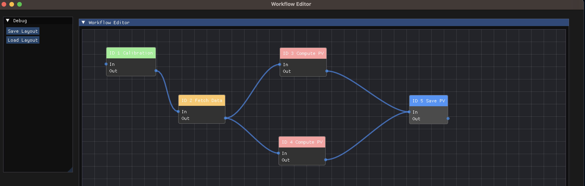

# 🧪 Eden Project

Eden is a modern C++ workflow engine designed for dependency-based task execution, featuring a visual editor built with ImGui and ImNodes. It is modular, extensible, and suitable for financial analytics or general-purpose orchestration pipelines.

## 📦 Features

✅ **Core Engine**
- Workflow Execution with task dependencies  
- Multithreaded Scheduler using ThreadPool with std::jthread  
- Task Interface (ITask) with lifecycle tracking  
- Context Injection to provide task-specific configuration  
- Flexible Logging via LoggerManager, with support for console and file output  
- PathManager for robust file handling  
- JSON-based Serialization for workflows and context  

**ThreadPool**  
This module implements a high-performance, lock-free ThreadPool designed for concurrent task execution.

Key Features:

Lock-free job stack using std::atomic<Node*>

Cooperative cancellation via std::jthread and std::stop_token

Task scheduling with a std::counting_semaphore

Pluggable thread count provider
The main thread pool implementation:  

- Starts n worker threads via std::jthread  
- Maintains a lock-free stack of tasks  
- Synchronizes threads using std::counting_semaphore  
- Supports graceful shutdown via RAII  

Construction:  

- Use explicit thread count or a provider  

- Enqueue:  
Push a job onto the atomic stack  
Signal the semaphore to wake up a thread  

- Worker Loop:  
Wait on semaphore  
CAS pop a task  
Execute the task, loop until cancelled

- Destruction:  
Release all semaphores to unblock  
std::jthread automatically calls request_stop() and joins  

✅ **Visual Workflow Editor**
- Built with ImGui + ImNodes
- Drag-and-drop graph layout
- Dynamic status coloring (Running, Completed, Failed, etc.)
- Save/load workflow layout with preserved node positions

🧑‍💻 Requirements

C++20 compiler (GCC ≥ 11, Clang ≥ 13, MSVC ≥ 2022)  
CMake ≥ 3.20  

Dependencies:  
ImGui  
ImNodes  
nlohmann/json  
fmt  
SDL2 + OpenGL3 (for editor)  

outputs:
    build/Debug/bin
    build/Debug/lib

🚀 Getting Started

git clone https://github.com/yourusername/eden.git
cd eden
mkdir build && cd build
cmake ..
make -j
